# AI 资讯自动处理流程图 (手绘风格)

此代码配置了 Mermaid 的 **手绘风格 (Hand-Drawn)** 参数。
如果您的 Obsidian Mermaid 版本较新（v10.9+），将直接呈现类似 Excalidraw 的**铅笔手绘效果**。
如果这一步效果不明显，请务必使用 **"Mermaid to Excalidraw"** 将代码导入 Excalidraw 获得完美的素描质感。

```mermaid
%%{init: {
  'look': 'handDrawn', 
  'theme': 'neutral', 
  'themeVariables': { 
    'fontFamily': 'Virgil, Comic Sans MS', 
    'fontSize': '16px', 
    'lineColor': '#333'
  }
}}%%
flowchart TD
    %% --- 定义样式类 ---
    classDef base fill:#fff,stroke:#333,stroke-width:2px;
    classDef startEnd fill:#ffecb3,stroke:#ff6f00,stroke-width:2px,color:#d84315;
    classDef process fill:#e1f5fe,stroke:#0277bd,stroke-width:2px;
    classDef decision fill:#fff9c4,stroke:#fbc02d,stroke-width:2px;
    classDef api fill:#e8f5e9,stroke:#2e7d32,stroke-width:2px,stroke-dasharray: 5 5;
    classDef highlight fill:#f3e5f5,stroke:#7b1fa2,stroke-width:2px;

    %% --- 主流程 ---
    Schedule((定时任务<br/>每天 08:00)):::base --> Start([启动程序]):::startEnd
    Start --> Init[加载配置 .env]:::process
    Init --> Auth[Gmail API 认证]:::api
    Auth --> Search["🔍 搜索目标邮件<br/>Label: AI subscription"]:::api
    
    Search --> CheckEmails{是否找到邮件?}:::decision
    CheckEmails -- 无 --> End([结束任务]):::startEnd
    CheckEmails -- 有 --> LoopStart(开始循环处理):::process
    
    %% --- 邮件处理子图 ---
    subgraph Email_Processing ["📧 邮件处理流程"]
        direction TB
        LoopStart --> CacheEmail{本地有缓存?}:::decision
        CacheEmail -- 是 --> LoadEmail[📂 读取本地 JSON]:::base
        CacheEmail -- 否 --> FetchEmail[☁️ 调用 Gmail API]:::api
        FetchEmail --> SaveEmail[💾 保存 JSON 缓存]:::base
        SaveEmail --> LoadEmail
        
        LoadEmail --> Parse[HTML 解析与清洗]:::process
        Parse --> Extract["🔗 提取链接 & 🖼️ 识别图片"]:::process
        Extract --> Content[组装 Markdown]:::process
        
        Content --> CacheTrans{本地有翻译?}:::decision
        CacheTrans -- 是 --> LoadTrans[📂 读取本地翻译]:::base
        CacheTrans -- 否 --> AIPrompt["📝 构建 AI Prompt"]:::process
        
        %% --- AI 翻译子图 ---
        subgraph AI_Translation ["🤖 AI 翻译核心 (含重试)"]
            direction TB
            AIPrompt --> APICall["🚀 调用大模型 API<br/>(MiniMax / 智谱 AI)"]:::highlight
            APICall --> Timeout{请求成功?}:::decision
            
            Timeout -- 是 --> Restore[🔗 还原链接 ID]:::process
            Timeout -- 否 --> RetryCheck{剩余重试次数?}:::decision
            
            RetryCheck -- 是 --> Wait["⏳ 等待 (指数退避)<br/>2s, 4s, 8s"]:::process
            Wait --> APICall
            
            RetryCheck -- 否 --> Error[❌ 抛出错误]:::startEnd
            Error --> FailLog[📝 记录日志]:::process
        end
        
        Restore --> SaveTrans[💾 保存翻译缓存]:::base
        SaveTrans --> LoadTrans
    end
    
    LoadTrans --> Obsidian[Obsidian 写入器]:::process
    Obsidian --> Download["⬇️ 下载图片<br/>🔄 替换占位符"]:::api
    Download --> SaveFile["✅ 保存 .md 文件<br/>/News/AI-Updates/"]:::highlight
    
    SaveFile --> MarkRead[📧 标记为已读]:::api
    MarkRead --> LoopEnd{还有下一封?}:::decision
    
    LoopEnd -- 是 --> LoopStart
    LoopEnd -- 否 --> Summary[📊 生成统计报告]:::process
    Summary --> End
    FailLog --> LoopEnd
    
    %% 强制子图透明背景
    style Email_Processing fill:none,stroke:#666,stroke-width:2px,stroke-dasharray: 5 5
    style AI_Translation fill:none,stroke:#333,stroke-width:2px
```

